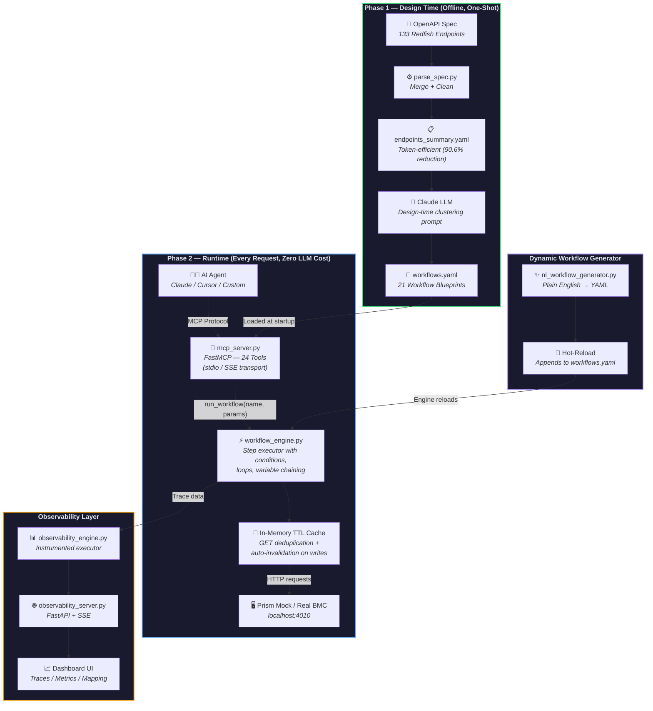
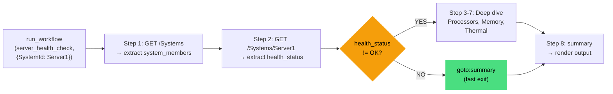
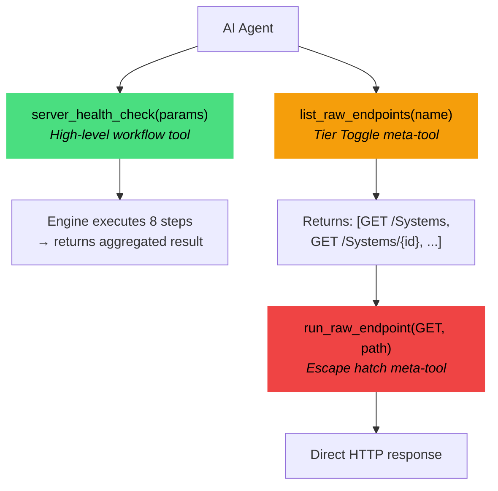
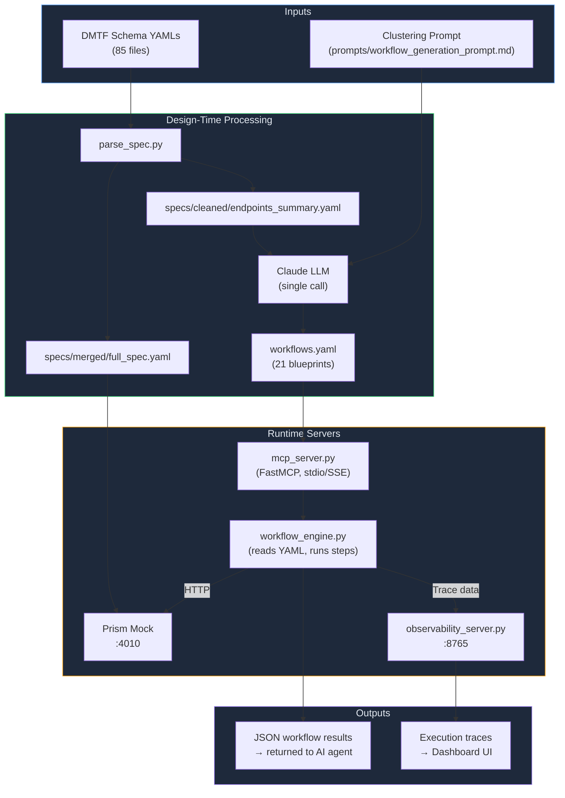

# Architecture — MCP Workflow Proxy

## Overview

The MCP Workflow Proxy is a **two-phase system** that transforms a raw OpenAPI spec into a lean set of semantic MCP workflow tools. The key insight is separating the expensive AI clustering work (done once, offline) from the lightweight runtime execution (done on every agent request, with zero LLM calls).

**Key numbers:** 133 raw Redfish API endpoints → **21 workflow tools + 3 meta-tools = 24 MCP tools** — an **82.0% tool reduction** and **74.7% token savings**.

---

## System Architecture Diagram



---

## Component Breakdown

### Phase 1 — Spec Ingestion & Cleaning

**Files:** `download_spec.py`, `parse_spec.py`, `fix_spec_for_prism.py`

| Component | Input | Output | Purpose |
|-----------|-------|--------|---------|
| `download_spec.py` | DMTF Redfish schema URLs | `specs/raw/*.yaml` | Downloads 85 schema YAML files |
| `parse_spec.py` | `specs/raw/*.yaml` | `specs/merged/full_spec.yaml`, `specs/cleaned/endpoints_summary.yaml` | Merges schemas, constructs 133 API paths, cleans for LLM |
| `fix_spec_for_prism.py` | `full_spec.yaml` | Patched spec | Removes Prism incompatibilities |

The cleaning step reduces 410,562 tokens to 38,445 — a **90.6% reduction** — before the spec even reaches the LLM. This is critical: the LLM only sees what it needs to cluster endpoints, not the full schema detail.

---

### Phase 2 — AI Clustering (Design-Time)

**Files:** `workflows.yaml`, `prompts/workflow_generation_prompt.md`

This is the only point where a large LLM is called. The prompt instructs Claude to:

1. Read all 133 endpoints
2. Group them into 10–30 semantic workflows based on real IT operator mental models
3. Output a structured `workflows.yaml` with exact step definitions, conditions, loops, and variable extraction rules

**Clustering strategy:**
- **By resource domain** — Systems, Chassis, Managers, UpdateService, etc.
- **By operational intent** — monitoring vs configuration vs lifecycle vs security
- **By call sequence** — endpoints that always appear together in real tasks are grouped (e.g., list → get → act)

**Output schema per workflow:**

```yaml
- name: server_health_check
  description: "..."
  category: monitoring
  parameters: [...]
  steps:
    - step_id: get_system
      action: GET
      endpoint: /redfish/v1/Systems/{SystemId}
      extract:
        health_status: $.Status.Health
      condition:
        if: health_status != 'OK'
        then: continue
        else: goto:summary
  raw_endpoints: [...]   # full list of underlying calls
  output_template: "..."
```

---

### Phase 3 — Runtime Engine

**File:** `workflow_engine.py`

A pure-Python execution engine. **Zero LLM calls at runtime.** It reads `workflows.yaml` and executes workflows step-by-step:



**Engine capabilities:**
- **Template resolution** — `{SystemId}` → `"Server1"` in every URL
- **JSONPath extraction** — `$.Status.Health` pulls values from JSON responses (custom zero-dependency implementation)
- **Condition evaluation** — `if/then/else` and `goto:step_id` branching
- **Loop execution** — `loop_over: members` iterates a collection, `break_if` stops early
- **Error handling** — per-step `on_error: continue | stop | goto:step_id`
- **Variable chaining** — extracted values from Step N are available in Step N+1
- **In-memory caching** — TTLCache for GET requests, auto-invalidated on writes

---

### Phase 4 — MCP Server

**File:** `mcp_server.py`

Wraps the engine in a [FastMCP](https://github.com/jlowin/fastmcp) server. At startup it:

1. Instantiates `WorkflowEngine` (loads `workflows.yaml`)
2. Dynamically registers one MCP tool per workflow using a factory closure (avoids Python's loop-variable capture bug)
3. Registers 3 meta-tools for hierarchical exposure

```python
# Dynamic registration — one tool per workflow
for wf in engine.list_workflows():
    fn = _make_workflow_tool(wf["name"], wf["description"], wf["parameters"])
    mcp.tool()(fn)
```

**Transport:** stdio (for Claude Desktop / Cursor). Can also run as SSE for HTTP clients.

**Hierarchical Exposure — the Tier Toggle:**



This lets the agent handle edge cases without breaking the abstraction entirely.

---

### Phase 5 — Integration & Metrics

**Files:** `calculate_metrics.py`, `claude_desktop_config.json`

Validates and proves the system meets acceptance criteria:

- **`calculate_metrics.py`** — computes before/after token and tool counts from the actual artifacts
- **`specs/after_metrics.json`** — serialized proof: 82.0% tool reduction, 74.7% token reduction

---

### Bonus: Observability Dashboard

**Files:** `observability_engine.py`, `observability_server.py`, `dashboard/`

A FastAPI-powered real-time dashboard providing:

- **Overview** — live statistics with Chart.js visualizations
- **Workflow Map** — interactive mapping from workflows to raw endpoints
- **Execution Traces** — step-by-step timings via Server-Sent Events (SSE)
- **Workflow Catalog** — searchable library of all 21 blueprints
- **NL Builder** — generate new workflows from plain English prompts

### Bonus: Natural Language Workflow Builder

**File:** `nl_workflow_generator.py`

Generates new workflow YAML from plain English prompts. Uses Gemini Pro via RapidAPI when available, falls back to a local heuristic engine. Generated workflows are automatically appended to `workflows.yaml` and hot-reloaded into the running MCP server.

---

## Data Flow Diagram



---

## Workflow Clustering Strategy

The clustering is performed by Claude using the prompt in `prompts/workflow_generation_prompt.md`. The strategy enforces:

### 1. IT Operator Mental Models
Workflows map to what an IT operator would actually say to a colleague:
- ❌ `GET_Systems_SystemId_Processors_ProcessorId` (machine-centric)
- ✅ `server_health_check` (operator-centric)

### 2. Resource Affinity
Endpoints on the same resource tree are grouped together. Example:
```
server_health_check covers:
  /redfish/v1/Systems
  /redfish/v1/Systems/{SystemId}
  /redfish/v1/Systems/{SystemId}/Processors
  /redfish/v1/Systems/{SystemId}/Processors/{ProcessorId}
  /redfish/v1/Systems/{SystemId}/Memory
  /redfish/v1/Systems/{SystemId}/Memory/{MemoryId}
  /redfish/v1/Chassis/{ChassisId}/Thermal
```

### 3. Operational Sequence
Endpoints that are always called in sequence become a single workflow. `firmware_update` covers the full operation: check → list → get version → compare → push → poll task.

### 4. Conditional Fast-Paths
Workflows include skip/goto logic so healthy systems return after 2 calls instead of 8:
```yaml
condition:
  if: health_status != 'OK'
  then: continue       # deep-dive only when degraded
  else: goto:summary   # fast exit when healthy
```

### 5. Category Coverage
All 21 workflows are distributed across 6 operational domains to ensure comprehensive coverage:

| Category | Count | Examples |
|----------|-------|---------|
| **monitoring** | 5 | `server_health_check`, `thermal_and_power_monitoring`, `telemetry_metrics_collection` |
| **configuration** | 4 | `bios_configuration`, `storage_management`, `network_configuration` |
| **security** | 4 | `user_account_management`, `session_management`, `certificate_management` |
| **maintenance** | 3 | `firmware_update`, `bmc_manager_operations` |
| **diagnostics** | 3 | `log_collection`, `task_management` |
| **lifecycle** | 2 | `server_power_operations`, `virtual_media_operations` |

---

## Key Trade-offs

### Trade-off 1: Static Clustering vs Dynamic
**Chosen:** Static clustering at design time (one LLM call)
**Alternative:** Dynamic clustering at request time (LLM decides which tools to combine)
**Why:** Static clustering means zero LLM overhead at runtime, fully deterministic execution, and auditable workflows. Dynamic approaches add latency, cost, and non-determinism on every request.

### Trade-off 2: Granularity of Workflows
**Chosen:** 21 workflows (average 7 endpoints each)
**Alternative:** Fewer, coarser workflows (e.g., 5) or more fine-grained (e.g., 40)
**Why:** ~20 is the sweet spot — enough detail for the agent to pick the right tool, few enough to stay well within context limits. The 3 meta-tools provide a drill-down escape hatch for edge cases.

### Trade-off 3: Hierarchical Exposure vs Flat Tool Set
**Chosen:** Two-tier model — 21 high-level tools + 3 meta-tools for raw access
**Alternative:** Pure high-level only (no escape hatch)
**Why:** Production systems always have edge cases. The tier-toggle lets the AI handle novel situations without requiring a new workflow to be defined.

### Trade-off 4: YAML-driven vs Code-driven Workflows
**Chosen:** YAML blueprint (`workflows.yaml`) interpreted at runtime
**Alternative:** Hardcoded Python functions for each workflow
**Why:** YAML is human-readable, version-controllable, and editable without touching Python. A new IT operation can be added by editing the YAML — no code change required.

---

## Extensibility — Adding a New API

```
1. Place OpenAPI YAML spec in specs/raw/
2. python parse_spec.py --raw-dir specs/raw/
   → generates specs/cleaned/endpoints_summary.yaml

3. Open prompts/workflow_generation_prompt.md
   → paste contents of endpoints_summary.yaml at the bottom
   → send to Claude

4. Save Claude's output as workflows.yaml

5. python mcp_server.py
   → new workflows auto-registered as MCP tools
```

**Time: ~5 minutes.** No code changes required.

---

## Security Considerations

- The MCP server runs over stdio (local only) — no network exposure by default
- Prism mock server is local-only on `:4010`
- For production use against real BMC hardware, add Basic Auth or X-Auth-Token headers in `workflow_engine.py`'s `_http_request` method
- `workflows.yaml` acts as an allowlist — only endpoints explicitly defined in workflows can be called via the high-level tools
- `run_raw_endpoint` (the escape hatch) bypasses this allowlist — restrict or remove it in production if needed
